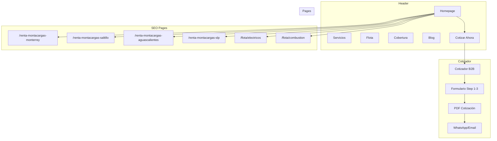

# SITE ARCHITECTURE - Renta Montacargas Noreste
## Website B2B | Región Noreste de México

---

## 1. VISIÓN GENERAL

**Tipo de sitio:** SaaS Marketing + Hybrid (B2B Services + Content)

**Objetivos principales:**
1. **Generar cotizaciones B2B** (conversión principal)
2. **Posicionar en SEO local** (4 ciudades, keywords industriales)
3. **Educar decisores** (contenido industrial B2B)

**Audiencia primaria:**
- Gerentes de Operaciones (35%)
- Gerentes de Logística (30%)
- Directores Generales / Procurement (25%)
- Empresas industriales: manufactura, automotriz, logística, almacén

---

## 2. JERARQUÍA DE PÁGINAS

### Estructura Principal (ASCII Tree)

```
Home (/)
├── Cotizador (/cotizador) ★ CTA PRINCIPAL
├── Servicios (/servicios)
│   ├── Renta Corta (/servicios/renta-corta)
│   ├── Renta Larga (/servicios/renta-larga)
│   ├── Venta (/servicios/venta)
│   └── Mantenimiento (/servicios/mantenimiento)
├── Flota (/flota)
│   ├── Electricos (/flota/electricos)
│   │   ├── 2.5 ton (/flota/electricos/2-5-ton)
│   │   └── 3.0 ton (/flota/electricos/3-ton)
│   ├── Combustion (/flota/combustion)
│   │   ├── Diesel 3.0 ton (/flota/combustion/diesel-3-ton)
│   │   └── Diesel 5.0 ton (/flota/combustion/diesel-5-ton)
│   └── Torretas (/flota/torretas)
├── Cobertura (/cobertura)
│   ├── Monterrey (/cobertura/monterrey)
│   ├── Saltillo (/cobertura/saltillo)
│   ├── Aguascalientes (/cobertura/aguascalientes)
│   └── San Luis Potosi (/cobertura/san-luis-potosi)
├── Blog (/blog)
│   ├── Mantenimiento (/blog/category/mantenimiento)
│   ├── Seguridad (/blog/category/seguridad)
│   ├── Casos de Estudio (/blog/category/casos)
│   └── Guías (/blog/category/guias)
├── Nosotros (/nosotros)
└── Contacto (/contacto)
```

---

## 3. MAPA DE URLs

| Página | URL | Prioridad | Nav |
|--------|-----|----------|-----|
| Homepage | `/` | Alta | Header |
| Cotizador B2B | `/cotizador` | **Alta** | Header (CTA) |
| Servicios | `/servicios` | Alta | Header |
| Renta Corta | `/servicios/renta-corta` | Media | Dropdown |
| Renta Larga | `/servicios/renta-larga` | Media | Dropdown |
| Venta | `/servicios/venta` | Media | Dropdown |
| Mantenimiento | `/servicios/mantenimiento` | Media | Dropdown |
| Flota | `/flota` | Alta | Header |
| Eléctricos | `/flota/electricos` | Media | Dropdown |
| Combustión | `/flota/combustion` | Media | Dropdown |
| Torretas | `/flota/torretas` | Media | Dropdown |
| Cobertura | `/cobertura` | Alta | Header |
| Monterrey | `/cobertura/monterrey` | Alta | Dropdown |
| Saltillo | `/cobertura/saltillo` | Alta | Dropdown |
| Aguascalientes | `/cobertura/aguascalientes` | Media | Dropdown |
| San Luis Potosí | `/cobertura/san-luis-potosi` | Media | Dropdown |
| Blog | `/blog` | Media | Header |
| Nosotros | `/nosotros` | Baja | Footer |
| Contacto | `/contacto` | Alta | Footer + Header |

---

## 4. NAVEGACIÓN

### Header Navigation

| Posición | Elemento | URL | Notas |
|----------|----------|-----|-------|
| 1 (Logo) | MN^ | `/` | Vincula a home |
| 2 | Servicios | `/servicios` | Dropdown con 4 sub-items |
| 3 | Flota | `/flota` | Dropdown por tipo |
| 4 | Cobertura | `/cobertura` | Dropdown por ciudad |
| 5 | Blog | `/blog` | Contenido industrial |
| 6 | Nosotros | `/nosotros` | Sobre la empresa |
| 7 (CTA) | **[Cotizar Ahora]** | `/cotizador` | Botón naranja, prominent |

### Footer Navigation

**Columna 1 - Servicios**
- Renta corta / larga
- Venta de montacargas
- Mantenimiento preventivo
- Refacciones

**Columna 2 - Cobertura**
- Monterrey
- Saltillo
- Aguascalientes
- San Luis Potosí

**Columna 3 - Recursos**
- Blog industrial
- Casos de estudio
- Guía de selección
- Calculadora ROI

**Columna 4 - Empresa**
- Nosotros
- Contacto
- Trabaja con nosotros

---

## 5. COTIZADOR B2B (Diferenciador Clave)

### URL: `/cotizador`

### Campos del Formulario

| Campo | Tipo | Requerido | Descripción |
|-------|------|-----------|-------------|
| Nombre | text | Sí | Contacto principal |
| Empresa | text | Sí | Nombre de la empresa |
| Cargo | select | Sí | Gerencia/Logística/Procurement/Otro |
| Email | email | Sí | Corporativo preferido |
| WhatsApp | tel | Sí | Con lada |
| Ciudad | select | Sí | MTY/Saltillo/Aguascalientes/SLP |
| Tipo de Equipo | select | Sí | Eléctrico/Diesel/Torreta |
| Capacidad | select | Sí | 2.5 ton / 3.0 ton / 5.0 ton |
| Duración | select | Sí | Diario / Semanal / Mensual / Anual |
| Volumen | number | No | Cantidad de equipos |
| Mensaje | textarea | No | Detalles adicionales |

### Comportamiento

1. **Step 1:** Datos de contacto + empresa
2. **Step 2:** Tipo de necesidad (equipo, duración)
3. **Step 3:** Confirmación → genera PDF cotización + WhatsApp

### Output

- PDF cotización automática con precios
- Envío por email + WhatsApp
- Guardado en CRM para seguimiento

---

## 6. PÁGINAS PROGRAMÁTICAS SEO

### Template: Ciudad + Tipo + Industria

```
/renta-montacargas-monterrey/
/renta-montacargas-saltillo/
/renta-montacargas-aguascalientes/
/renta-montacargas-san-luis-potosi/

/renta-montacargas-electrico-monterrey/
/renta-montacargas-diesel-saltillo/
/renta-montacargas-torretas-aguascalientes/

/montacargas-para-manufactura-monterrey/
/montacargas-para-almacen-saltillo/
/montacargas-para-automotriz-aguascalientes/
```

**Total estimado: 50+ páginas**

---

## 7. ESTRUCTURA BLOG

### Categorías

| Categoría | Slug | Frecuencia | Temas |
|----------|------|------------|-------|
| Mantenimiento | `/blog/category/mantenimiento` | 2/mes | Tips preventivos,检修 guides |
| Seguridad | `/blog/category/seguridad` | 1/mes | Normas OSHA, mejores prácticas |
| Casos de Estudio | `/blog/category/casos` | 1/mes | Empresas destacadas, ROI real |
| Guías | `/blog/category/guias` | 2/mes | Cómo elegir, comparativas |

### Hub-and-Spoke

```
Hub: /blog/guia-completa-montacargas
├── Spoke: /blog/tipos-de-montacargas (link al hub)
├── Spoke: /blog/electrico-vs-diesel (link al hub)
├── Spoke: /blog/como-elegir-capacidad (link al hub)
└── Spoke: /blog/mantenimiento-preventivo (link al hub)
```

---

## 8. DIAGRAMA VISUAL (Mermaid)



---

## 9. CHECKLIST TÉCNICO

### SEO On-Page

- [ ] Meta titles únicos por página (60 chars)
- [ ] Meta descriptions únicos (155 chars)
- [ ] H1 con keyword principal
- [ ] Schema LocalBusiness por ciudad
- [ ] Schema Service para cada tipo de renta
- [ ] Schema Product para montacargas en venta
- [ ] FAQ schema en páginas de cobertura
- [ ] Breadcrumbs en todas las páginas

### Performance

- [ ] LCP < 2.5s
- [ ] Mobile-first responsive
- [ ] Lazy loading para imágenes de flota
- [ ] Preload de fuentes Montserrat/Open Sans

### Conversión

- [ ] CTA naranja en header visible
- [ ] Formulario de cotizador en sidebar en páginas de flota
- [ ] Pop-up de contacto solo en scroll profundo (no intrusivo)
- [ ] WhatsApp float button en todas las páginas

---

*Site Architecture creado: Mayo 2026*
*Versión 1.0*
