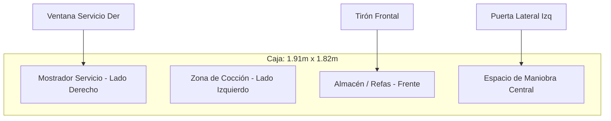

# Planos Organizados: Remolque Chilaquiles Aristeus 🌮📐

Este documento contiene las medidas reales extraídas de los bocetos técnicos realizados sobre las fotos del remolque y la distribución funcional recomendada.

---

## 1. Dimensiones Generales (Caja del Remolque)
El remolque tiene una forma compacta con un techo inclinado (más alto en la parte trasera).

| Dimensión | Medida | Notas |
| :--- | :--- | :--- |
| **Ancho (Frente/Atrás)** | 191.0 cm | Medida exterior de pared a pared. |
| **Largo (Costados)** | 182.0 cm | Longitud de la caja (sin incluir el tirón). |
| **Alto Máximo (Posterior)** | 204.0 cm | Altura en la esquina trasera derecha. |
| **Alto Mínimo (Frontal)** | 188.5 cm | Altura en la esquina delantera izquierda. |

---

## 2. Detalles por Alzado

### A. Alzado Frontal (Lado del Tirón)
*   **Ancho:** 191 cm.
*   **Altura Izquierda:** 188.5 cm.
*   **Altura Derecha:** 204 cm.
*   **Tirón (Hitch):** Estructura triangular de acero centrada.

### B. Alzado Lateral Izquierdo
*   **Largo:** 182 cm.
*   **Puerta de Acceso:**
    *   **Ancho:** 81 cm.
    *   **Alto:** 174.5 cm.
    *   **Posición:** A 46 cm de la esquina frontal.

### C. Alzado Lateral Derecho (Servicio)
*   **Largo:** 182 cm.
*   **Ventanilla de Servicio:**
    *   **Ancho:** 127 cm.
    *   **Alto:** 51 cm.
    *   **Posición:** Centrada aproximadamente (45 cm de margen a cada lado).

---

## 3. Diagrama de Distribución (Layout)

## 4. Especificaciones por Área

### A. Área de Cocción (Lado Izquierdo)
*   **Parrilla/Quemadores**: Espacio optimizado para sartenes grandes de chilaquiles.
*   **Baño María**: Para mantener las salsas (roja, verde) calientes.
*   **Extracción**: Campana necesaria debido al espacio reducido para evitar calor excesivo.

### B. Área de Servicio (Lado Derecho)
*   **Ventanilla de 1.27m**: Espacio amplio para atención fluida.
*   **Mostrador Interno**: Para ensamblado final y entrega.

---

## 5. Notas de Remodelación
1.  **Pendiente del Techo:** La diferencia de ~15cm entre el frente y atrás debe considerarse para el drenaje.
2.  **Espacio de Maniobra:** Con solo 1.82m de largo, el diseño debe ser lineal y muy eficiente.
3.  **Branding:** He generado un **Dashboard Interactivo (BLUEPRINT_DASHBOARD.html)** para que puedas visualizar estos planos en 3D.

---
*Archivo actualizado con las medidas de las fotos originales.*
